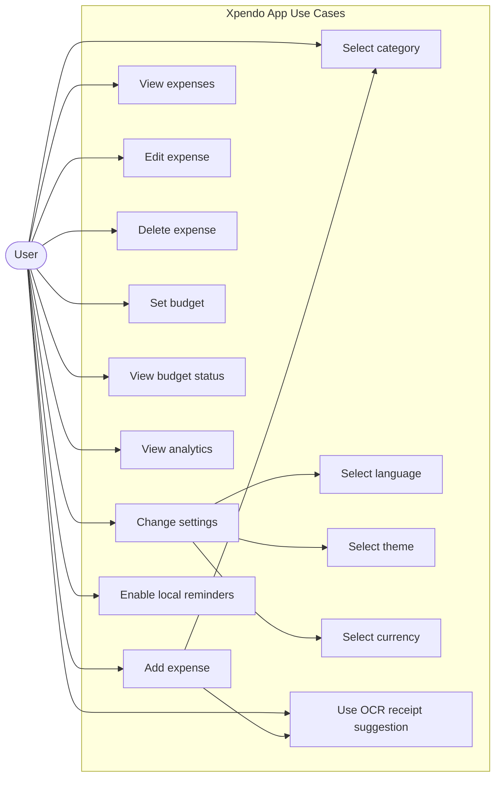
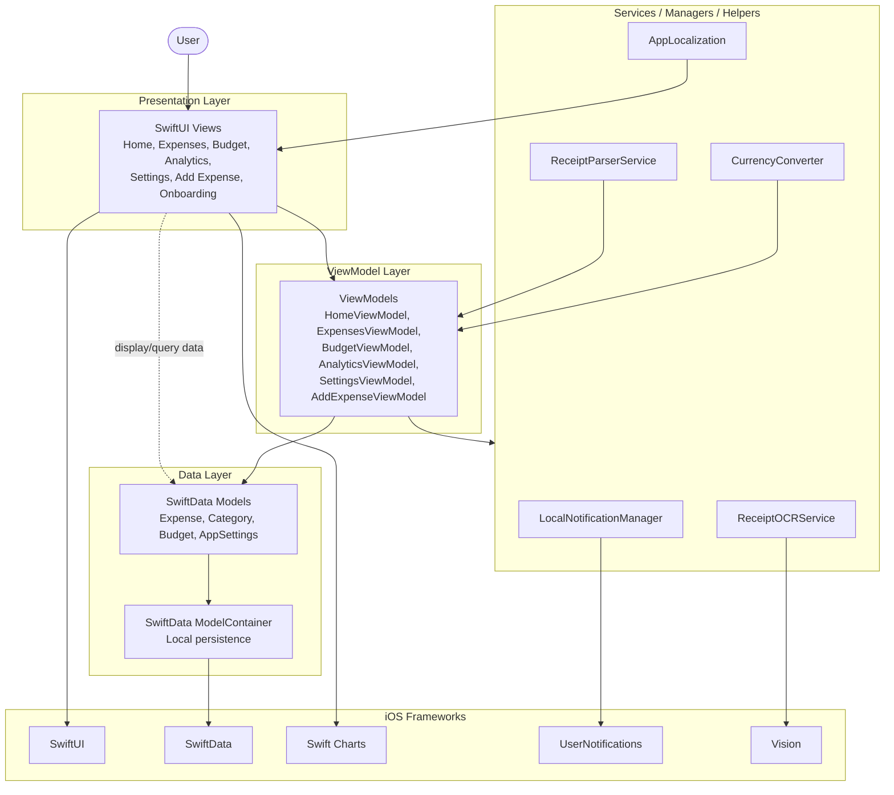
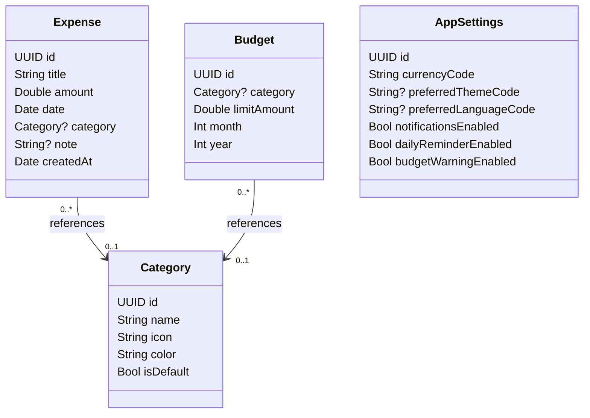
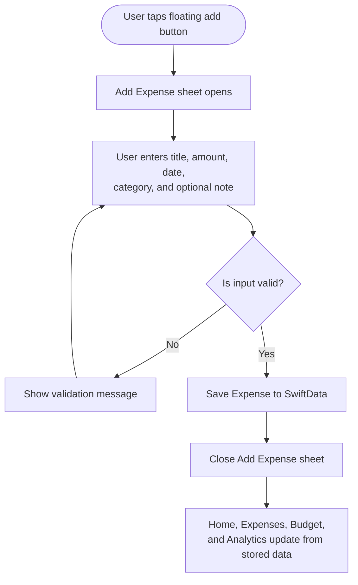
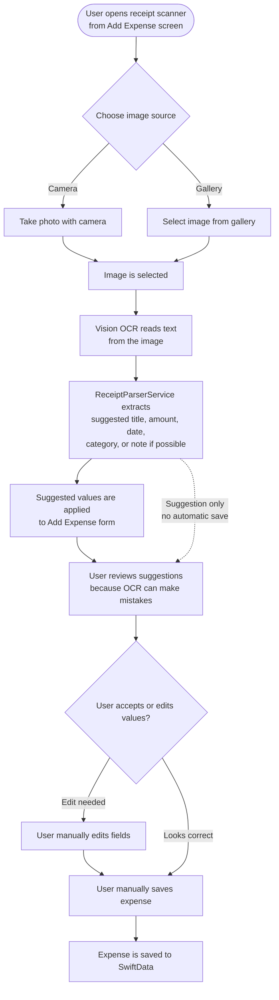
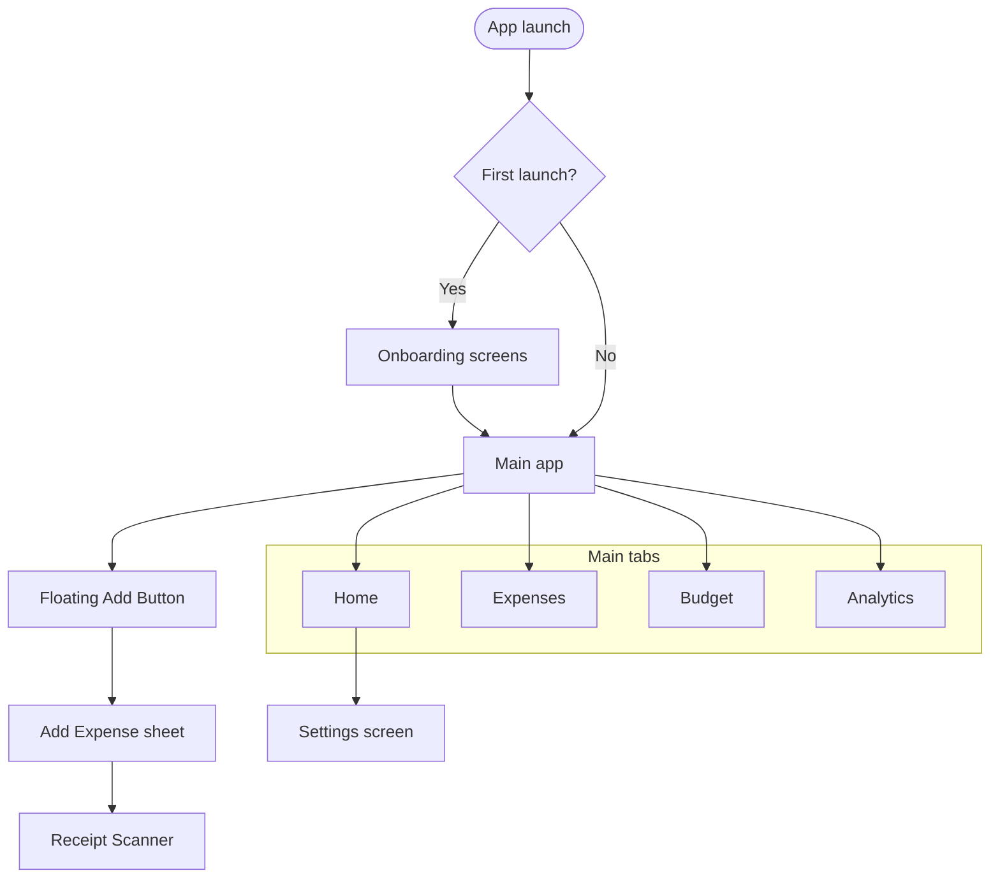

# Xpendo Graduation Report Diagram Drafts

This file contains simple Mermaid diagram drafts for the Xpendo graduation report and final presentation. The diagrams reflect the current project scope: local expense tracking, SwiftData persistence, local notifications, OCR-based receipt suggestions, localization, theme/currency settings, budgeting, and analytics. Login/signup, multi-user support, bank integration, and active CloudKit/iCloud sync are intentionally not shown as implemented features.

## 1. Use Case Diagram

### Purpose

This diagram summarizes the main actions that a user can perform in the Xpendo app.

### Short Explanation

The user can record and manage expenses, select categories, manage budgets, view analytics, change preferences, use OCR as a receipt suggestion tool, and enable local reminders. The diagram does not include login, cloud sync, bank integration, or multi-user support because these are not implemented as active app features.

### Suggested Report Placement

Requirements Analysis or System Analysis section.

### Suggested Figure Caption

Figure X. Use case diagram of the Xpendo mobile application.

## 2. MVVM Architecture Diagram

### Purpose

This diagram shows the high-level architecture of Xpendo and how SwiftUI views, ViewModels, SwiftData models, services, and iOS frameworks work together.

### Short Explanation

The user interacts with SwiftUI screens. The screens use ViewModels for business logic and SwiftData models for local data. Services support notifications, OCR, receipt parsing, currency conversion, and localization. SwiftData stores app data locally through the ModelContainer.

### Suggested Report Placement

System Design or Software Architecture section.

### Suggested Figure Caption

Figure X. MVVM-based architecture of the Xpendo iOS application.

## 3. Data Model / Class Diagram

### Purpose

This diagram shows the main persistent data models used by the app and their relationships.

### Short Explanation

`Expense` stores spending records and can reference a category. `Budget` stores monthly category-based limits and can also reference a category. `Category` stores predefined category information. `AppSettings` stores app preferences and notification options without direct relationships to other models.

### Suggested Report Placement

Database Design, Data Model, or Implementation section.

### Suggested Figure Caption

Figure X. SwiftData model structure used in Xpendo.

## 4. Add Expense Flow Diagram

### Purpose

This diagram explains how a new expense is manually added and saved in the app.

### Short Explanation

The user opens the Add Expense sheet, enters the required details, and the app validates the input. Invalid input shows a validation message. Valid input is saved to SwiftData, then the related screens update from the stored data.

### Suggested Report Placement

Implementation, User Flow, or Functional Design section.

### Suggested Figure Caption

Figure X. Add expense workflow in Xpendo.

## 5. OCR Receipt Suggestion Flow Diagram

### Purpose

This diagram shows how OCR helps fill the Add Expense form. It clearly shows that OCR provides suggestions only and does not automatically save an expense.

### Short Explanation

The OCR feature reads text from a receipt image and uses parser logic to suggest possible expense values. The app does not automatically save the expense after OCR. The user must review, correct if necessary, and manually save the expense.

### Suggested Report Placement

Implementation, OCR Feature, or User Flow section.

### Suggested Figure Caption

Figure X. OCR-based receipt suggestion workflow in Xpendo.

## 6. Navigation Flow Diagram

### Purpose

This diagram describes the main navigation structure of the app.

### Short Explanation

On first launch, the user sees onboarding. After onboarding, the main app opens with four tabs: Home, Expenses, Budget, and Analytics. The floating add button opens the Add Expense sheet. Settings is opened from Home, and the receipt scanner is opened from the Add Expense screen.

### Suggested Report Placement

UI/UX Design, Navigation Design, or Implementation section.

### Suggested Figure Caption

Figure X. Main navigation flow of the Xpendo application.

## Export Instructions

1. Copy one Mermaid code block from this file.
2. Open Mermaid Live Editor.
3. Paste the copied Mermaid code into the editor.
4. Export the diagram as PNG or SVG.
5. Insert the exported diagram into the graduation report or presentation.
